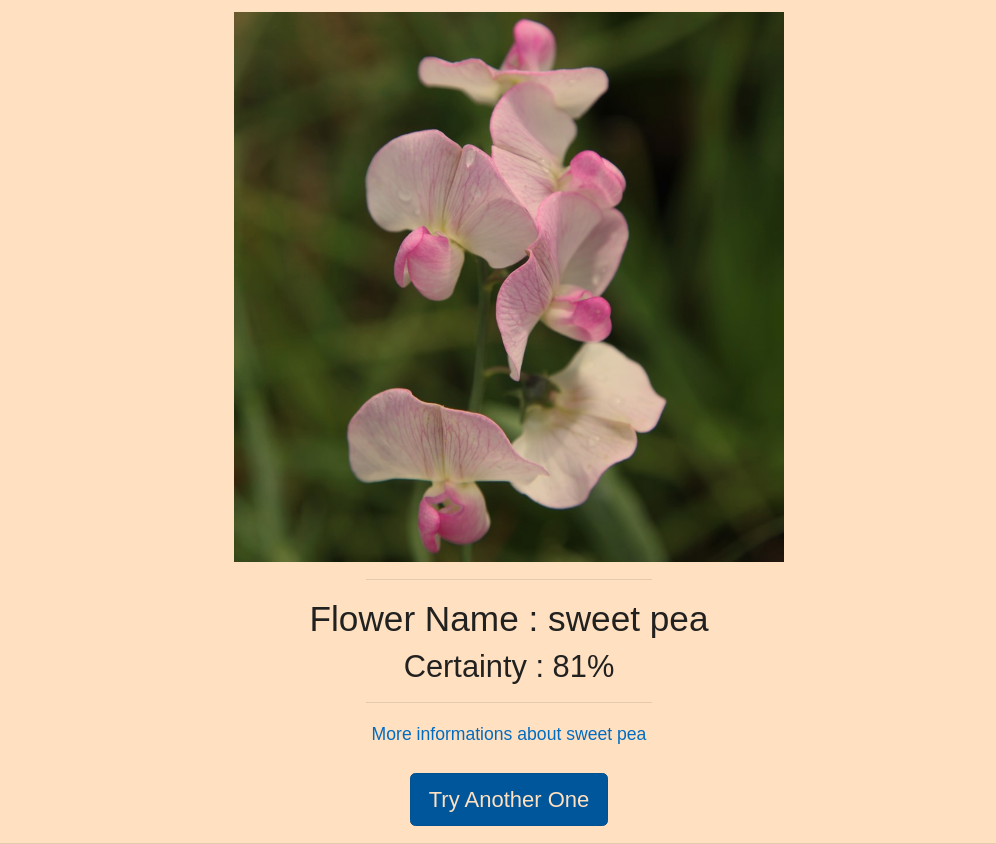

# DemystifAI  
 
|   **An extensible web platform of ML and AI applications and APIs.**  

---
### Getting started in 10 minutes  
- Clone this repo  
- Install requirements  
- Run the app.py scripts  
- Go to http://localhost:8080  
- Register, Sign in, Enjoy the ML apps!  

Screenshots  :
  

  

---
## Local installation  
### 1.Setting a new environment & installing requirements  
**1.1 Using *virtualenv***  
First install *virtualenv* package  
```
pip install virtualenv  
```
Create the environement folder  
```
virtualenv /path/to/my/env/envFolder 
``` 
Activate the environment  
+ MacOS/Linux :  
```
source envFolder/bin/activate  
```
+ Windows :  
```
envFolder\Scripts\activate  
```
**1.2 Using *Conda***  
First install *conda* in a given directory   
```
pip install conda  
```
Create a new environment  
```
conda create --name myEnvName Flask==1.1.1  
```
Activate the new environment  
```
conda activate myEnvName  
```
Install the requirements for the project *(Some of them are already installed with Flask but that's ok)* *  
```
conda install -r requirements.txt  
```
**Make sure you're in the project directory*  

### 2.DataBase Migration using FLASK-Migrate  
In order to make sure the modifications you bring to the project's models give effect to the corresponding sql tables, you must set correctly the migration for each sub-project *(web_apps and flowers_recogn for now)*.  
1- Set Environment Variable  
*within the app.py directory for both Web_Apps & APIs*  
+ MacOS/Linux  
```
export FLASK_APP=app.py  
```
+ Windows  
```
set FLASK_APP=app.py  
```
2- Set migration directory  
```
flask db init  
```
3- Set migration file  
```
flask db migrate -m "migration done"  
```
4- Upgrade the migration  
```
flask db upgrade 
```
### 3.Download the models' weights  
Download the models weights from this [link](https://www.dropbox.com/s/vyrgkmyptzqscbz/VGG_FNN_Tuned_Weights.h5?dl=0) and place them under the /ML_Models directories.  

### 4.Execution  
The modular architecture of the project requires running each compounding app seperately, thus, you should first open 2 separate bash command lines, one within the /Web_Apps directory, and the other under /APIs/FLOWERS_RECOGNITION. Once done, run the following command in both CLI :  
```
python app.py  
```
Open http://localhost:8080 and have fun.

---
## Similar Projects : 
- [Flowers Recognition WEBSITE DEMO](http://zeus.robots.ox.ac.uk/flower_demo/)
